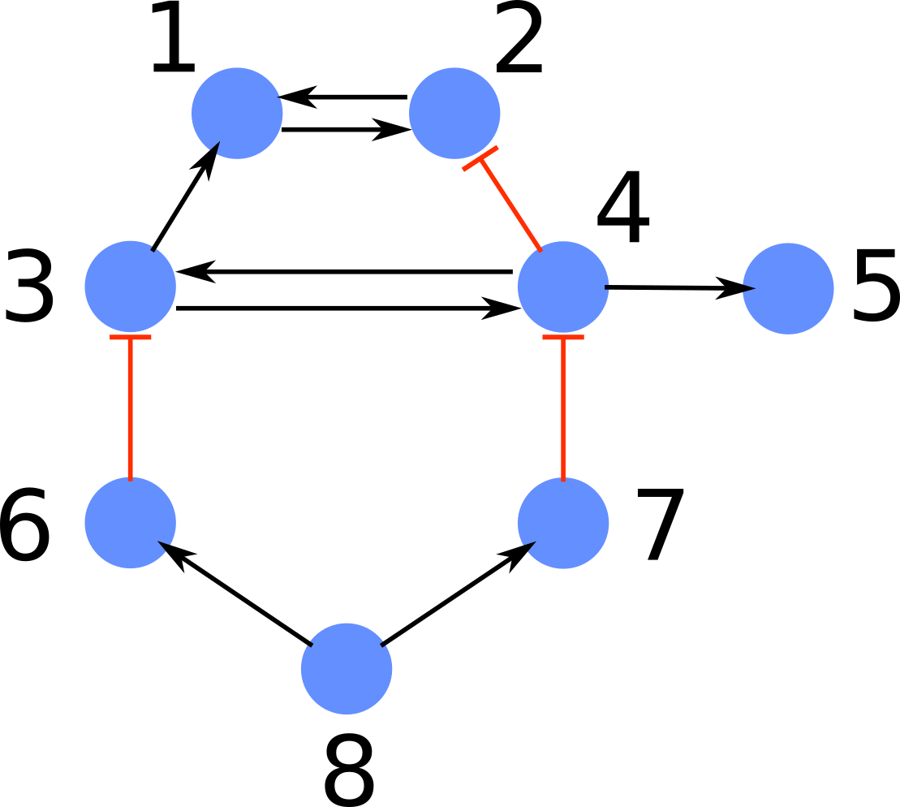

# Graph Fibrations on Julia

Implementation in Julia for the fast fibration partitioning (FFP) algorithm on directed networks. The algorithm is presented 
in the paper of *Monteiro et. al.* (link for the draft to be available soon). In this work we use the codes in this repo for
proper perfomance comparison between the FFP algorithm and other common methods for the identification of fibration symmetries. 

Fibration symmetries in context of complex networks are introduced in the recent work of [Morone et. al.](https://www.pnas.org/content/117/15/8306).

## Usage 

To find the fibration partitioning of a given network it is necessary only the information of the network structure (nodes and edges)
and the types of each edge (in case the edges are multidimensional). For this, the network must be parsed as an **edgelist file**. For
instance, let's consider the graph below where the edges can assume two possible values: 'positive' or 'negative'.



The edgefile for this graph, called `net.txt` should follow the format below

> 1 2 positive<br/>
> 2 1 positive<br/>
> 3 1 positive<br/>
> 3 4 positive<br/>
> 4 2 negative<br/>
> 4 3 positive<br/>
> 4 5 positive<br/>
> 6 3 negative<br/>
> 7 4 negative<br/>
> 8 6 positive<br/>
> 8 7 positive<br/>

In this file, the third column refers to the possible values of each edge. There is no restriction on the specific
format of its values as long as each different string represent a different edge type. For the first (source) and 
second (target) columns the node labels must be inside the interval \[1,N\] where N is the total number of nodes in
the graph.

Thus, to extract the fibers of the network provided by this edgefile, we run the 
following

```julia
include("fsym.jl")
import .fsym

g, fmt_eprops = fsym.load_net("net.txt", true)

edgetype = Int[]
map_regulation = Dict([("positive", 1) ("negative", 2)])
for reg in fmt_eprops["Column 1"]
    push!(edgetype, map_regulation[reg])
end
fsym.set_edges_properties("edgetype", edgetype, g)

partition = fsym.fast_fibration(g)
```

Where `partition` is a container holding `Fiber` structures. To access the nodes belonging to a specific fiber, we can check `.nodes`, like in `partition[1].nodes` for the first element of the container returned.


